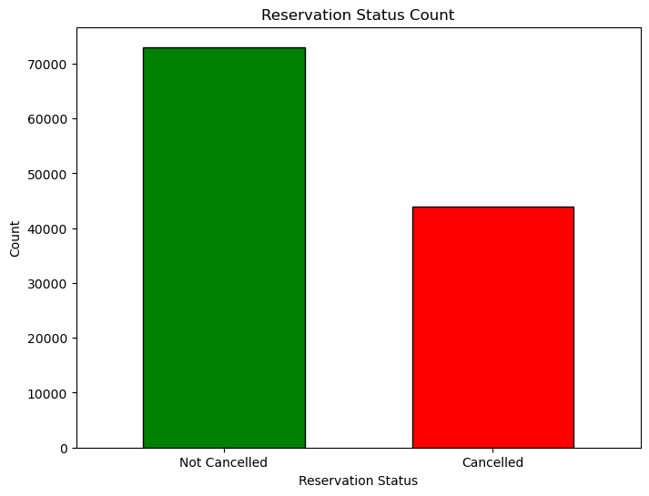
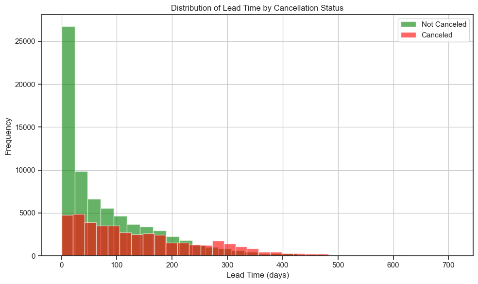
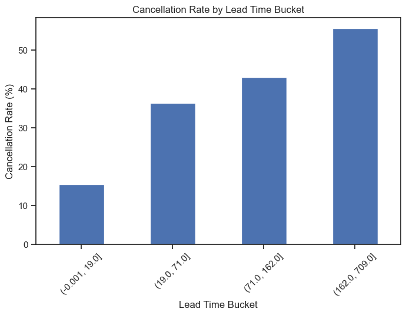
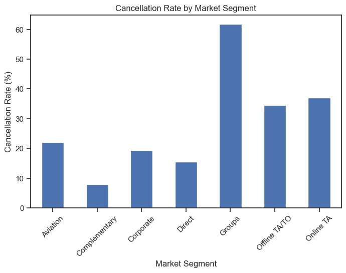
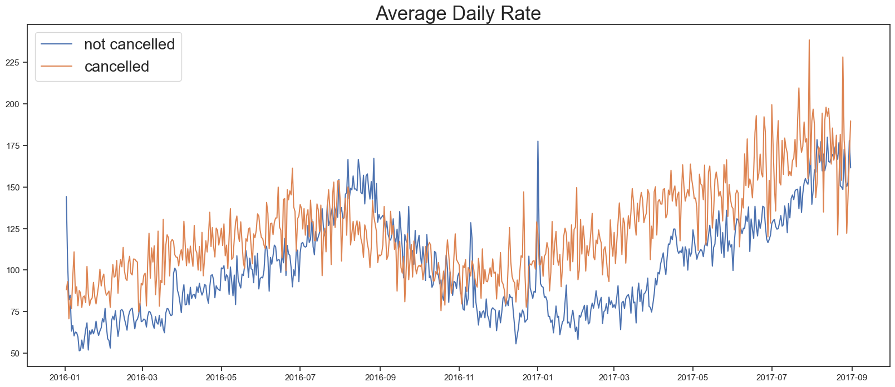
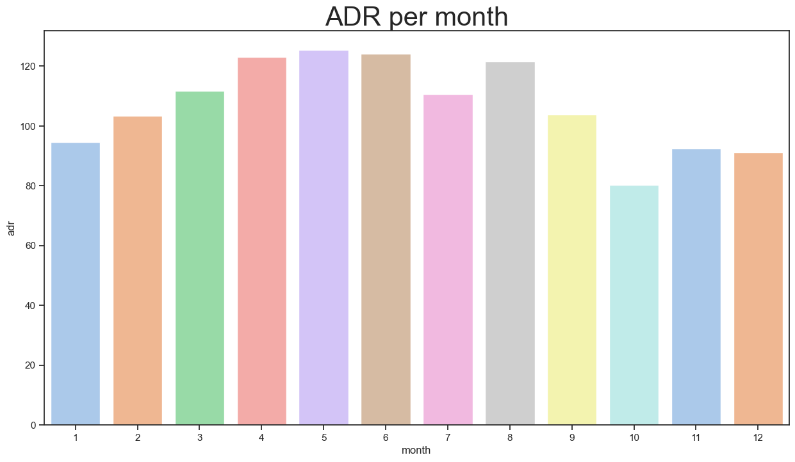

# 🏨 Hotel Booking Cancellation Analysis

## 📌 Project Overview

In recent years, hotels have experienced high booking cancellation rates, leading to revenue loss and inefficient room utilization.

This project analyzes hotel booking data to:

- Identify key factors driving cancellations  
- Understand customer behavior patterns  
- Provide data-driven business recommendations  
- Improve revenue stability and forecasting accuracy  

The analysis is performed using **Python, Pandas, Matplotlib, and Seaborn**.

---

## 🎯 Business Problem

Both City Hotel and Resort Hotel are facing significant booking cancellations. High cancellation rates impact:

- Revenue forecasting  
- Occupancy management  
- Operational planning  
- Overbooking strategy  

The objective is to determine:

> What factors most strongly influence booking cancellations?

---

## 🛠️ Tech Stack

- Python
- Pandas
- NumPy
- Matplotlib
- Seaborn
- Jupyter Notebook

---

## 📊 Key Analyses Performed

### 1️⃣ Overall Cancellation Rate

- ~37% of bookings were cancelled.
- City Hotel (42%) had higher cancellations than Resort Hotel (28%).

  

---

### 2️⃣ Lead Time Analysis (Most Important Finding 🔥)

Cancellation rate increases significantly with lead time:

| Lead Time | Cancellation Rate |
|------------|-------------------|
| 0–19 days | ~15% |
| 19–71 days | ~36% |
| 71–162 days | ~43% |
| 162+ days | ~56% |

  

  

**Conclusion:**  
Bookings made far in advance are much more likely to cancel.

Lead time is the strongest predictor of cancellation.

---

### 3️⃣ Market Segment Analysis

Cancellation rate by segment:

| Segment | Cancellation Rate |
|----------|-------------------|
| Groups | ~62% |
| Online TA | ~37% |
| Offline TA/TO | ~34% |
| Direct | ~15% |
| Corporate | ~19% |

  

**Conclusion:**  
Group bookings are extremely high risk.  
Direct and Corporate bookings are the most stable.

---

### 4️⃣ ADR (Price Sensitivity)

- Cancelled bookings tend to have higher Average Daily Rate (ADR).
- Higher-priced bookings show greater cancellation probability.

  

**Conclusion:**  
Price sensitivity influences cancellation behavior.

---

### 5️⃣ Seasonality

- Peak bookings: June–August  
- Higher ADR during May–June  
- January shows relatively high cancellation risk

  

 

  

 

Seasonality impacts demand but is not as strong as lead time or market segment.

---

## 🏆 Most Important Insights

1. **Lead Time is the strongest driver of cancellation.**
2. **Group bookings have the highest cancellation rate (~62%).**
3. **City Hotel is more vulnerable than Resort Hotel.**
4. **Higher ADR bookings show higher cancellation likelihood.**

---

## 💡 Business Recommendations

### 🔹 Lead-Time Based Policy
- Require deposits for long lead-time bookings
- Reduce flexible cancellation window
- Send reminder communications closer to arrival date

### 🔹 Group Booking Strategy
- Implement partial deposit requirements
- Apply tiered cancellation penalties
- Reconfirm bookings 30–45 days before arrival

### 🔹 OTA Strategy
- Promote non-refundable plans
- Encourage direct bookings
- Strengthen loyalty programs

---

## 📈 Potential Next Steps

- Build a Logistic Regression model to predict cancellations  
- Feature importance analysis  
- Develop a real-time cancellation risk scoring system  

---

## 📬 Connect With Me

If you would like to discuss data projects or opportunities, feel free to connect.

LinkedIn: www.linkedin.com/in/puja-kumari-634475373 
Email: pujasharma2520@gmail.com

---

⭐ If you found this repository useful, feel free to star it.
